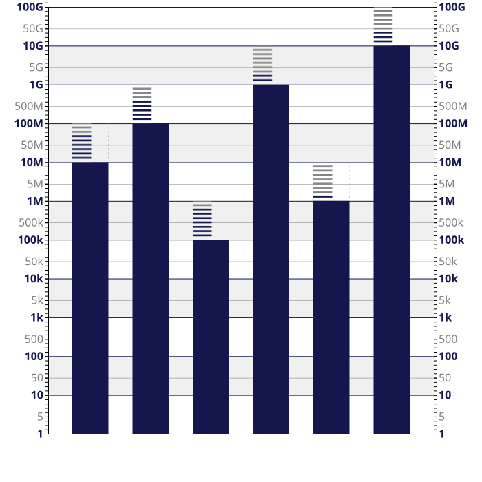

# Implementation of the EpluM scale for d3.
[](https://github.com/jdfekete/d3-eplusm/actions/workflows/node.js.yml)

D3 provides several scales in [d3-scale](https://github.com/d3/d3-scale): quantitative, ordered, and categorical. EplusM is a quantitative scale, a good alternative to the logarithmic scale for values with orders of magnitude varying widely.


See this publication for details: 
Katerina Batziakoudi, Florent Cabric, Stéphanie Rey, and Jean-Daniel Fekete. 2025. Lost in Magnitudes: Exploring Visualization Designs for Large Value Ranges. In Proceedings of the 2025 CHI Conference on Human Factors in Computing Systems (CHI '25). Association for Computing Machinery, New York, NY, USA, Article 1170, 1–18. https://doi.org/10.1145/3706598.3713487

## Using d3-eplusm

In JavaScript development, you can add the library in your `package.json` file with the following command:
```
npm i d3-eplusm
```

You can also use it directly from `unpkg.com` by adding this line to your HTML file (see `examples/ticks-cdn.html`):

``` html
<script type="module">
  import * as d3 from 'https://cdn.jsdelivr.net/npm/d3@7/+esm';
  import { scaleEplusM, bricksEplusM } from 'https://unpkg.com/d3-eplusm?module';
...
</script
```

You can also use `d3-eplusm` in Observable, by using `scaleEplusM = require("d3-eplusm@0.0.7-dev")` as shown is [this example](https://observablehq.com/d/3e0c87451c4eeec0).

## API

`d3-eplusm` provides two API: the EplusM scale using the d3 scale API, and a **Bricks** API to visualize bar charts using the **Bricks** encoding. 

## EplusM Scale

Like all the quantitative scales of d3, d3-eplusm can be used like this:
```
const x1 = scaleEplusM()
    .domain([1, 1e10])
    .range([marginLeft, width - marginRight]);
```

It provides the usual methods, such as `ticks()` and `nice()`.
In addition, you can also specify the number of tick values you want using the `goodTicks()` method.
It takes either a number of tick labels to show, between 1 and 9, or an array of tick units to show, such as `goodTicks([1, 5])` (equivalent to `goodTicks(2)` or simply `goodTicks`

## Bricks

The library provides helper functions to display `Bricks`. An EplusM bar chart with Bricks looks like this:



It requires the toplevel function `bricksEplusM`:

``` javascript
import { bricksEplusM } from 'd3-eplusm';
```

The library defines the following functions:

- `const bricks = bricksEplusM(brickColor)` returns an object to manage the bricks.
- `bricks.declarePatterns(svg)` takes a D3 svg object and adds ten brick pattern declarations, called `#brick0` to `#brick9`.
- `bricks.barY(scale, v)` returns the bar chart Y value for a bar with value `v`.
- `bricks.barHeight(scale, v)` returns the bar chart height value for a bar with value `v`.
- `bricks.brickY(scale, v)` returns the bar chart Y value for the brick part of a bar with value `v`.
- `bricks.brickHeight(scale, v)` returns the bar chart height value for the brick part of a bar with value `v`.
- `bricks.brickPattern(v)` returns the brick part pattern id of a bar with value `v`.

It is typically used like this (see `example/bricks.html`):

``` javascript
...
  // Add a rect for each bar without the bricks.
  svg
    .append('g')
      .attr('fill', barColor)
    .selectAll()
    .data(data)
    .join('rect')
      .attr('x', (d) => x(d.Letter))
      .attr('y', (d) => bricks.barY(y, d.Amount))
      .attr('height', (d) => bricks.barHeight(y, d.Amount))
      .attr('width', x.bandwidth());

  // Add the bricks
  svg
    .append('g')
    .selectAll()
    .data(data)
      .join('rect')
        .attr('fill', (d) => bricks.pattern(d.Amount))
        .attr('x', (d) => x(d.Letter))
        .attr('y', (d) => bricks.brickY(y, d.Amount))
        .attr('height', (d) => bricks.brickHeight(y, d.Amount))
        .attr('width', x.bandwidth());
```
